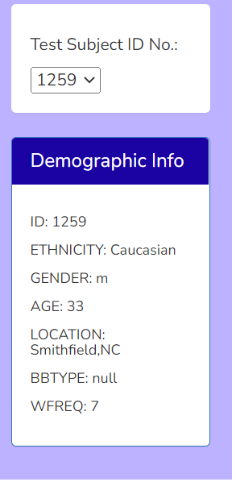
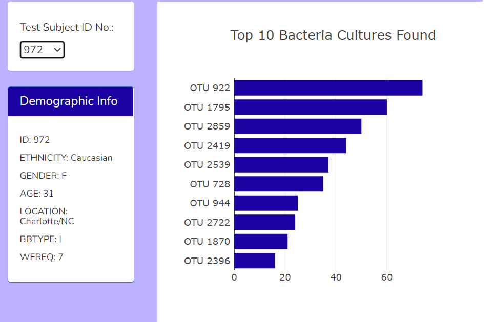
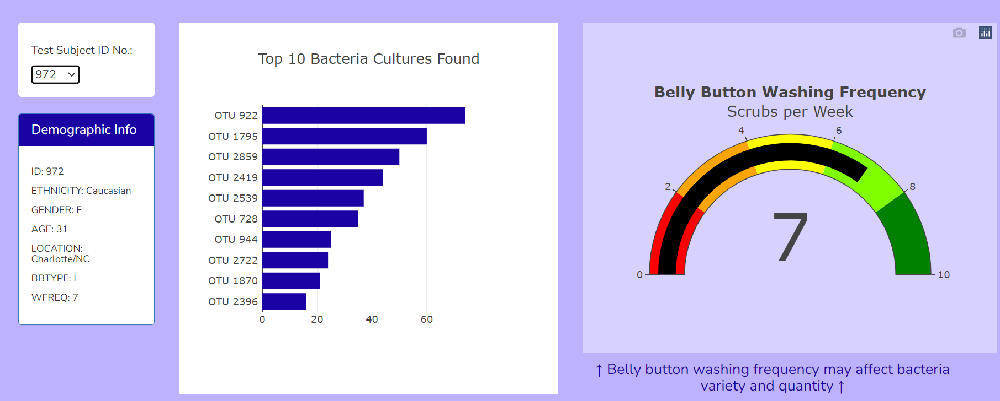

## Purpose of the analysis

From the demographic information, we need to visualize the bacterial data for each volunteer.

###

If we click on the 'Test Subject ID No.', the volunteers' demographic info will be loaded as shown in the screenshot below. 

and in screenshot next to it, the top 10 bacteria cultures found in belly button is shown. That way, if Improbable Beef identifies a species as a candidate to manufacture synthetic beef, Roza's volunteers will be able to identify whether that species is found in their navel.

Next to these images, is a gauge chart that displays the weekly washing frequency's value, and display the value as a measure from 0-10 on the progress bar in the gauge chart when an individual ID is selected from the dropdown menu.
